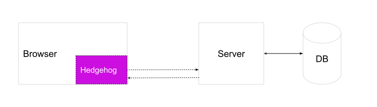

# Hedgehog
An alternative for Metamask that manages a user's private key and wallet on the browser and exposes an API to allow you to create an authentication scheme to let users sign up and login to their wallet across multiple browsers and devices.

For more in depth explanations and examples, please read the [Overview](#overview) and [Usage](#usage) sections.

Table of contents
=================

<!--ts-->
   * [Installation](#installation)
   * [Overview](#overview)
     * [Wallet creation](#wallet-creation)
     * [Wallet Persistence](#wallet-persistence)
     * [Code Organization](#code-organization)
     * [Security Considerations](#security-considerations)
     * [Lost Password Consideration](#lost-password-consideration)
   * [Funding Hedgehog Accounts](#funding-hedgehog-accounts)
     * [Fund User Wallets](#fund-user-wallets)
     * [EIP-712 Relay Transactions](#eip-712-relay-transactions)
   * [Usage Example](#usage-example)
   * [API](#api)
<!--te-->


## Installation
Hedgehog is available as an [npm package](). 

`npm install --save @audius/hedgehog`

## Overview



Hedgehog is a package that lives in your front end application to create and manage a user's entropy (from which a private key is derived) and interact with a REST API on a server and database of your choice to securely persist and retrieve auth artifacts. Hedgehog relies on user email and password to create auth artifacts, so it's able to simulate a familiar authentication system that allows users to sign up or login from multiple browsers or devices and retrieve their entropy. Since Hedgehog interacts with a REST API, it requires that you run a server or database, or use a managed solution, and conform to the API specified in the [Usage Example](#usage-example) section below. It also performs all cryptography necessary to create, secure and manage user private keys and wallets along the way.

Hedgehog generates a set of artifacts similar to a MyEtherWallet keystore file. Those artifacts can then be persisted to a database of your choice and retrieved with a hash computed from email address, password and an initialization vector. The private key is only computed and available client side and is never transmitted or stored anywhere besides the user's browser.

#### Wallet Creation

Wallets are created by first generating a wallet seed and entropy as per the [BIP-39 spec](https://github.com/bitcoin/bips/blob/master/bip-0039.mediawiki). The entropy can them be used to derive a hierarchical deterministic wallet given a path, as stated in the [BIP-32 spec](https://github.com/bitcoin/bips/blob/master/bip-0032.mediawiki). This entropy is stored in the browser's [localStorage](https://developer.mozilla.org/en-US/docs/Web/API/Window/localStorage#Browser_compatibility) to allow user state to persist across multiple sessions without any external dependency. Using this entropy, a wallet object from `ethereumjs-wallet` is generated and stored in the `wallet` property within the Hedgehog class on initialization, enabling state persistence.

In addition to the entropy, Hedgehog generates an initialization vector(`iv`), `lookupKey` and `cipherText`. These three values can be securely stored in a database and retrieved from a server to authenticate a user. The `iv` is a random hex string generated for each user to secure authentication. The `lookupKey` is the email and password combined with a pre-defined, constant, initialization vector(not the same `iv` that's stored in the database). This `lookupKey` acts as the primary key in the database to retrieve the `cipherText` and `iv` values. The `cipherText` is generated using an aes-256-cbc cipher with the `iv` and a key derived from a combination of the user's password and the iv using [scrypt](https://en.wikipedia.org/wiki/Scrypt) and stores the entropy. 

Since entropy is stored in the `cipherText`, it can be derived from there if we know the `iv` and key(scrypt of user's password and `iv`). After the entropy is decrypted, it's stored in the browser on a local `ethereumjs-wallet` object as well as in localStorage. The encryption and decryption process happens exclusively on the client side with the user's password or entropy never leaving the browser without first being encrypted.

For API of functions to access and modify wallet state, please see the [API](#api) section

#### Wallet Persistence

The wallet information can be persisted on the backend of your choice. You as the developer have the choice to pick which language and frameworks to use, write the endpoints to suit any custom logic necessary and selecting a hosting provider (if any). 

The database schema for persisting data should resemble the following example. There two tables, one for storing authentication information, and the other for storing email and ownerWallet. It's important that the email is not stored in the Authentications table because the `lookupKey` is a scrypt hash of a predefined iv with an email and password combination. If the data in these tables were ever exposed, susceptibility of a [rainbow table attack](https://en.wikipedia.org/wiki/Rainbow_table) could increase because the password is the only unknown property. These tables can be named anything since Hedgehog only interacts with REST API endpoints that will perform CRUD on these tables.


##### Authentications
| iv | cipherText | lookupKey |
| - | - | - |
| c9b3...48 | 07...e561 | 0e...2a8 |
| d6...355 | 059f...561 | 15e...3c0 |
| 99...6e | f4...07 | 18...10 |

The values and explanation for fields in the Authentications table (`iv`, `cipherText` and `lookupKey`) are given in the [Wallet creation](#wallet-creation) section


##### Users
| email | ownerWallet |        
| - | - |
| email1^@hedgehogtest.com | 0xad7a4b1c64a10ebf7f4995bc88fcbf1749c72611 |
| seconde*mail@hedgehogtest.com | 0x2b88420100514fbd8a48c3c427c6251335bcd8d0 |

#### Code Organization

The Hedgehog package is organized into several files with varying levels of control.

* <b>index.js</b> - default exports for the npm module, exports each of the src/ modules below
* <b>src/hedgehog.js</b> -  main constructor with primary consumable public facing API and high level functions
* <b>src/walletManager.js</b> - wallet management logic including localStorage, and end to end authentication functionality
* <b>src/authentication.js</b> - low level authentication functions (eg create iv, encrypt hash etc)

#### Security Considerations

All third party javascript should be audited for localStorage access. One possible attack vector is a script that loops through all localStorage keys and sends them to a third party server from where those keys could be used to sign transactions on behalf of malicious actors. To mitigate this, all third party javascript should be audited and stored locally to serve, instead of being loaded dynamically through scripts.

Email should be stored separately from auth artifacts in different tables. The table containing the authentication values should be independent with no relation to the table storing email addresses

#### Lost Password WARNING

If a user loses their password, the account is no longer recoverable. There's no way to reset a password because the entropy is encrypted client side before it's sent to the database. And since the old password is required to decrypt the entropy and re-encrypt with a new password, if the password used to encrypt the entropy has been lost or forgotten, the account is not recoverable. 

## Funding Hedgehog Accounts

Since Hedgehog creates and manages wallets client side, just like Metamask, the problem of funding a wallet still exists. When performing only reads from a blockchain, there's usually no transaction fees. However, write transactions typically require fees, and the onus is on the transaction sender to pay these fees. 

This is less than ideal for an end user facing product since users will be required to pay when submitting transactions - without a technology or cryptocurrency background, self-funding wallets is an unrealistic requirement.

There are two ways to try to solve this problem: fund user wallets or use EIP-712 relay transactions.

#### Fund User Wallets

As part of the endpoint which persists the ownerWallet, you can fund any new `ownerWallet`'s created. When a new wallet is created, you could send a small amount of tokens to that address so the user can sign and send transactions to the chain browser side. The downside is there could be potential for abuse where someone farms accounts to collect tokens because these accounts would be funded directly. 

#### EIP-712 Relay Transactions

Another option is to have users sign their transactions browser side, but relay their transaction through an EIP-712 relayer which submits their transaction to chain. Any transaction costs incurred would be paid by the relayer instead of the user, however the original user transaction data is preserved and submitted.

For more information about EIP-712, please see the following links:

https://github.com/ethereum/EIPs/blob/master/EIPS/eip-712.md

https://medium.com/metamask/eip712-is-coming-what-to-expect-and-how-to-use-it-bb92fd1a7a26

## Usage Example

The code below shows a simple wrapper to integrate Hedgehog into your own application. For a fully working end-to-end demo with a backend hosted on Firebase, click [here](https://codesandbox.io/embed/pp9zzv2n00)
```js
/**
 * hedgehogWrapper.js
 * 
 * Something similar to this file would reside in your codebase.
 * This initializes the hedgehog module and exports it for the rest of your project to consume
 */

// Hedgehog is the package export that should be used by most users
// WalletManager and Authentication imports are possible but not recommended
// and should only be used by advanced users
const { Hedgehog, /*WalletManager, Authentication */ } = require('@audius/hedgehog')
const axios = require('axios')

// This is a helper function that makes XHR requests to a server of your choice
// and parses the response status code
const makeRequestToService = async (axiosRequestObj) => {
  axiosRequestObj.baseURL = 'http://hedgehog.base-url.com'

  try {
    const resp = await axios(axiosRequestObj)
    if (resp.status === 200) {
      return resp.data
    } else {
      throw new Error(`Server returned error: ${resp.status.toString()} ${resp.data['error']}`)
    }
  } catch (e) {
    console.error(e)
    throw new Error(`Server returned error: ${e.response.status.toString()} ${e.response.data['error']}`)
  }
}


/**
 * The setFn is the endpoint used to send data to the backend of your choice to persist user and authentication information
 * @param {Object} obj contains {iv, cipherText, lookupKey, ownerWallet, email}
 */
const setFn = async (obj) => {
  await makeRequestToService({
    url: '/authentication/sign_up',
    method: 'post',
    data: obj
  })
}

/**
 * The getFn is the endpoint used to retrieve authentication data from the backend of your choice
 * @param {Object} obj contains {iv, cipherText, lookupKey}
 */
const getFn = async (obj) => {
  return makeRequestToService({
    url: '/authentication/login',
    method: 'get',
    params: obj
  })
}

// The Hedgehog constructor takes in two functions, a `setFn` and a `getFn`.
// Each function is defined above
const hedgehog = new Hedgehog(getFn, setFn)

module.exports = hedgehog

```

```js
/**
 * This is how you use the hedgehog module to do authentication
 * and wallet management in your codebase.
 * 
 * The import is from the hedgehogWrapper.js code snippet above
 */

const hedgehog = require('./hedgehogWrapper')

// wallet management and creation/login flow
let walletObj = null

try {
  if (hedgehog.isLoggedIn()) {
    walletObj = hedgehog.getWallet()
  }
  else {
    // Ask for email/password input for login or signup

    walletObj = await hedgehog.login('email@domain.com', 'password')
    // or
    walletObj = await hedgehog.signUp('email@domain.com', 'password')
  }
}
catch(e) {
  throw e
}
```

## API

The functions exposed via hedgehog are:

  ```js
  /**
   * Given user credentials, create a client side wallet and all other authentication artifacts,
   * call setFn to persist the artifacts to a server and return the wallet object
   * @param {String} email user email address
   * @param {String} password user password
   * @returns {Object} ethereumjs-wallet wallet object
   */
async signUp (email, password)

/**
   * Given user credentials, attempt to get authentication artifacts from server using
   * getFn, create the private key using the artifacts and the user password
   * @param {String} email user email address
   * @param {String} password user password
   * @returns {Object} ethereumjs-wallet wallet object
   */
async login (email, password)

/**
   * Deletes the local client side wallet including entropy and all associated
   * authentication artifacts
   */
logout ()

/**
   * Returns is the user has a client side wallet. If they do, calls can be made against
   * that wallet, if they don't the user has to login or signup
   * @returns {Boolean} true if the user has a client side wallet, false otherwise
   */
isLoggedIn ()

/**
   * Returns the current user wallet
   * @returns {Object} ethereumjs-wallet wallet object if a wallet exists, otherwise null
   */
getWallet ()

/**
   * If a user refreshes or navigates away from the page and comes back later, this attempts
   * to restore the client side wallet from localStorage, if it exists
   * @returns {Object/null} If the user has a wallet client side, the wallet object is returned,
   *                        otherwise null is returned
   */
restoreLocalWallet ()

/**
   * Create a new client side wallet object without going through the signup flow. This is useful
   * if you need a temporary, read-only wallet that is ephemeral and does not need to be persisted
   * @param {String} password user password
   * @returns {Object} ethereumjs-wallet wallet object
   */
async createWalletObj (password)
```